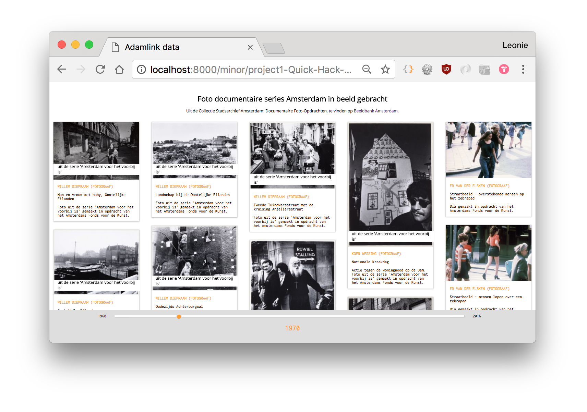
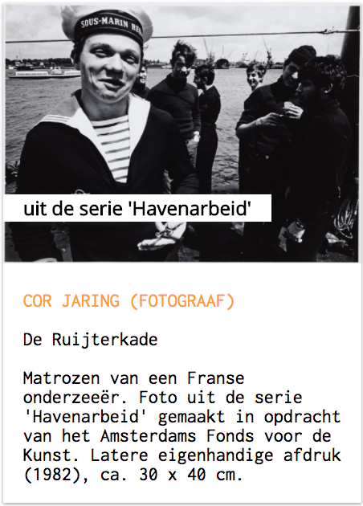
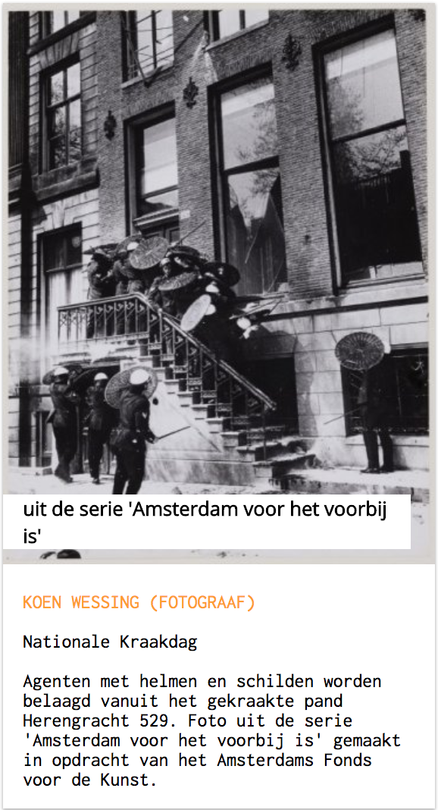
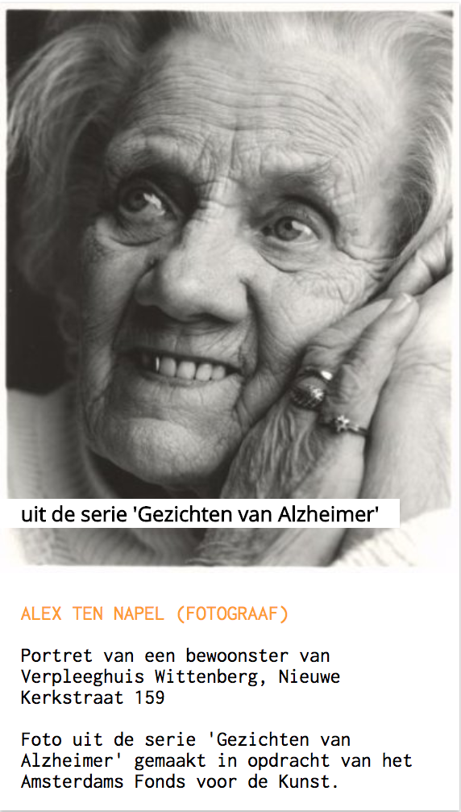
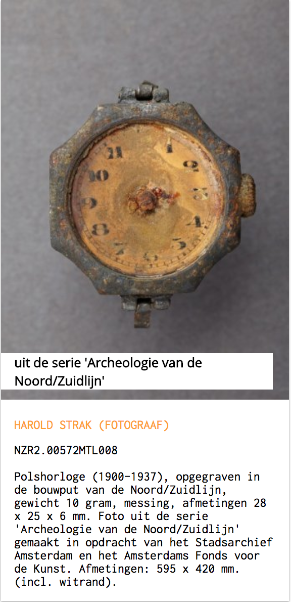
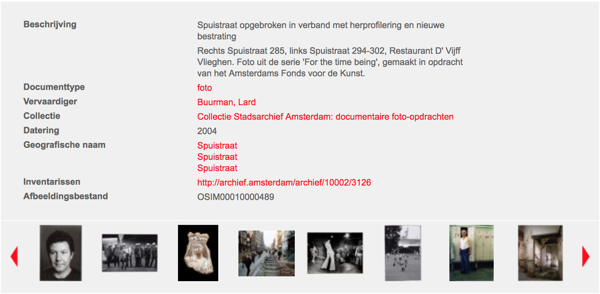

# API Stadsarchief Amsterdam

[link to the project](https://leoniesmits.github.io/project1-Quick-Hack-Prototype/)

In de week van 5 tot 9 maart 2018 mochten wij aan een project werken in de OBA, waar we met ingeladen data web apps hebben gemaakt.

## Mijn project


Mijn project richt zich op de [collectie "documentaire foto-opdrachten" binnen de Beeldbank van het Stadsarchief](http://beeldbank.amsterdam.nl/beeldbank?f_sk_collectie=Collectie+Stadsarchief+Amsterdam%3A+documentaire+foto-opdrachten). De data wordt ingeladen door een tijdlijn, waarop de gebruiker een jaar selecteerd en daarmee de foto-series van dat jaar ophaalt. 

### De dataset

Na te hebben gezocht in de beeldbank, kwam ik veel interessante en mooie foto's tegen uit collecties zoals 
- [Collectie New York Perspectives](http://beeldbank.amsterdam.nl/beeldbank?f_sk_collectie=Collectie+New+York+Perspectives): Hoe New Yorkse fotografen Amsterdam zien en vastleggen
- [Collectie Zuidas](http://beeldbank.amsterdam.nl/beeldbank/sortering/sk_datering_ASC/start/320?f_sk_collectie=Collectie+Zuidas%3A+foto%27s): Collectie van zeker 4000 foto's over de Zuidas
- [Archief van Woon- en Bouwkundetoezicht: bouwtekeningen](http://beeldbank.amsterdam.nl/beeldbank/sortering/sk_datering_DESC?f_sk_collectie=Archief+van+de+Dienst+Bouw-+en+Woningtoezicht%3A+bouwtekeningen): Bouwtekeningen van historische Amsterdamse gebouwen, 14.000 afbeeldingen vanaf 1858.
-  [Stichting IJbeeld](http://beeldbank.amsterdam.nl/beeldbank/sortering/sk_datering_DESC?f_sk_collectie=Collectie+Stichting+IJbeeld%3A+foto%27s): Meer dan 3000 foto's van het IJ.

#### Mijn collectie
De door mij gekozen collectie gaat over foto's die gemaakt zijn voor documentaire series. Bijna al deze foto's zijn gemaakt in opdracht van het Amsterdams Fonds voor de Kunst. 

Documentaires kunnen een goed beeld geven van de tijd waarin ze zijn gemaakt. Zo werd er in 1960 een documentaire-serie gemaakt over "Havenarbeid"

In 1970 werd onder andere de serie "Amsterdam voor het voorbij is" gemaakt met foto's zoals deze hieronder, maar ook veel foto's van de normale mens die over straat loopt. 

In 1996 werd onder andere deze fotoserie gemaakt, die erg intiem is en dichtbij de kwetsbaarheid van mensen komt. 

Tot slot, een serie in 2011, waarin opgravingen van de constructie rondom de Noord/Zuidlijn zijn gefotografeerd.

Nog een ander groot voordeel van deze collectie, is dat bij 90% van de foto's de beschrijving hetzelfde is opgesteld. De naam van de serie is in dezelfde zin uitgedrukt en is dus op te zoeken in de dataset. 


### De applicatie

###### Ophalen van de data
Ik ben begonnen met de data ophalen via een sparql query en deze te printen in de console, zodat ik de architectuur van de data kan zien en kan inplannen welke stappen ik moet zetten. 

```javascript
var sparqlquery = `PREFIX dc: <http://purl.org/dc/elements/1.1/>
            PREFIX dct: <http://purl.org/dc/terms/>
            PREFIX sem: <http://semanticweb.cs.vu.nl/2009/11/sem/>
            PREFIX foaf: <http://xmlns.com/foaf/0.1/>
            PREFIX void: <http://rdfs.org/ns/void#>
            SELECT ?cho ?year ?img ?title ?description ?creator WHERE {
                ?cho dc:description ?description .
                ?cho dc:title ?title .
                ?cho sem:hasBeginTimeStamp ?start .
                ?cho foaf:depiction ?img .
                BIND (year(xsd:dateTime(?start)) AS ?year) .
                ?cho void:inDataset <https://data.adamlink.nl/saa/beeldbank/> .
                ?cho dct:provenance "Collectie Stadsarchief Amsterdam: documentaire foto-opdrachten"^^xsd:string .
                OPTIONAL { ?cho dc:creator ?creator }
            }`
```

In deze variabele verklaar ik welke aspecten van de data ik wil hebben: 
- `dc titel`: bovenste stukje van de beschrijving
- `dc: description`: onderste stukje van de beschrijving
- `hasBeginTimeStamp` & `BIND (year(xsd:dateTime(?start)) AS ?year)`: het eerst genoemde jaar, als deze beschikbaar is
- `dct: provenance`: selecteer alleen deze collectie uit de beeldbank
- `dc: creator': de fotograaf

###### De slider

In het object slider, wordt eerst activeyear gegeven op 1960, zodat de applicatie bij het opstarten begint met deze data in te laden en op het scherm te zetten. Daarna begint een functie die selectYear heet.
```javascript
var slider = {
    activeYear: 1960,
    selectYear: function(data) {
        var sliderInput = document.getElementById("year");
        var result = document.getElementById("result");

        sliderInput.addEventListener("input", sliderResult);
        
        function sliderResult() {
            var integerValue = parseInt(sliderInput.value);
            result.innerHTML = integerValue;
            slider.activeYear =  sliderInput.value;
            var yearlyData = data.filter(collection.filterYear);
            var resultArray = collection.groupBy(yearlyData, function(item)
            {
                return [item.creator.value];
            });

            template.section(resultArray);
        }
        
    }
}
```
In deze functie worden de elementen uit de HTML opgevraagt en staat er een eventListener op de input (de range slider). De waarde vanuit deze slider wordt opgevraagd en opgeslagen nadat het event getriggerd wordt. Dit geselecteerde jaar wordt doorgestuurd naar een ander object, daar wordt de data gegroepeerd op fotograaf.

Het plan om de foto's op serie te selecteren wordt verhinderd omdat niet elke foto een serie vermeld heeft staan. Wel hebben alle foto's een fotograaf vermeld en zijn series altijd door dezelfde persoon gemaakt. Deze persoon maakt in elk geval maar 1x per jaar een serie.

###### Groeperen
Op deze manier is gegroepeerd op fotograaf:
```javascript
groupBy: function(yearlyData, f) {
            var groups = {};
            yearlyData.forEach(function (o) {
                var group = f(o);
                groups[group] = groups[group] || [];
                groups[group].push( o ); 
            });
            return Object.keys(groups).map(function(group) {
                return groups[group]; 
            })
        },
```
Voor elke regel van de data die geselecteerd is op jaar, wordt een functie uitgevoerd. Al in het vorige object wordt gespecifieerd dat het om de fotograaf gaat. 

###### Data in de DOM injecteren
Door de diepe nesting van de objecten in de arrays gebruik ik een forEach, nog een forEach en dan een .push om de uitkomst buiten de laatste forEach te kunnen gebruiken. 

```javascript
items.forEach(function(obj, i) {
                    objects.push({
                        image: obj.img.value,
                        description: obj.description.value,
                        title: obj.title.value,
                        source: obj.cho.value,
                        serie: serieValue[i],
                        creator: obj.creator.value
                    })
                })
```
Op deze manier zijn alle values uit de dataset verbonden aan elementen die communiceren met de HTML via Transparency. 

```javascript
Transparency.render(document.getElementById('section'), objects, directive)
            var loader = document.querySelectorAll('#loader');
            loader.forEach(function(i){
                i.classList.add("hidden")
            })
```
Onder de render van Transparency wordt de loader aangeroepen. Pas als de Transparency regel is verwerkt, zet hij de "hidden" class op de loader, zodat deze alleen zichtbaar is wanneer de afbeeldingen nog ontbreken.


###### De serie eruit filteren
In het bovenstaande stukje code refereert het element serie naar dit object:

```javascript
filterSerie: function (item) {
            var serieObj = item.description.value;
            var findSerie = /uit de serie '(.*?)'/g;
            var serie = findSerie.exec(serieObj);
            if (!serie) {
                return;
            } else {
                console.log(1, serie[1])
                return serie[0]
            }
        }
```
De precieze zoekterm wordt opgeslagen in een variabele en deze wordt met .exec verbonden aan de description van de afbeelding. Wanneer deze overeenkomt, staat de afbeelding gelijk aan serie. Wanneer dit niet zo is, krijgt de regel niks terug en blijft dus leeg. Als de afbeelding hier wel mee overeen komt, vraagt de functie de eerste regel van het object terug. Dit wordt geinjecteerd in de HTML.

 ## Features

* [`SPARQL`](https://www.w3.org/TR/sparql11-query/)
* [`.exec`](https://developer.mozilla.org/en-US/docs/Web/JavaScript/Reference/Global_Objects/RegExp/exec) - zoek een specifieke string
* [`forEach`](https://developer.mozilla.org/en-US/docs/Web/JavaScript/Reference/Global_Objects/Array/forEach) 


## Licence 

All the rights go to [Stadsarchief Amsterdam](https://www.amsterdam.nl/stadsarchief/) for the images. 
All rights for features used in the library go to [W3 Sparql](https://www.w3.org/TR/sparql11-query/). 
Copyright © 2018 Leonie Smits. Released under the [MIT license](https://opensource.org/licenses/MIT)
